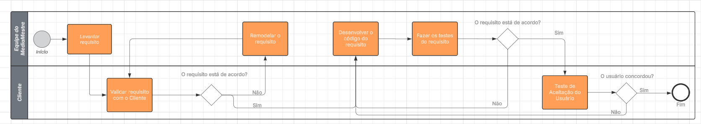

## Processo de Desenvolvimento de Software e Notação BPMN

A notação BPMN é utilizada para modelar processos de negócios, o que permite uma representação clara e compreensível dos fluxos de decisões no que tange as atividades do projeto.

### Diagrama BPMN do Processo de Requisitos MediaMestre

