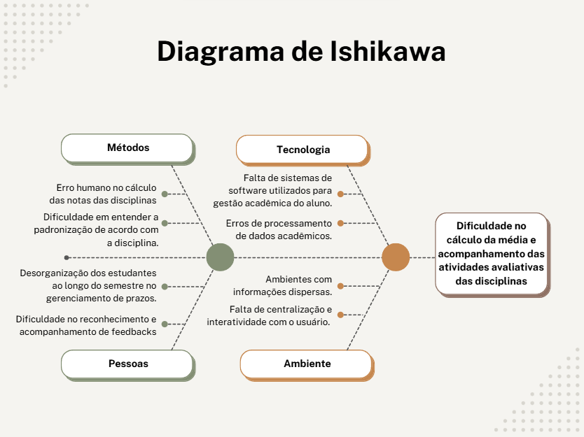

## Visão do Produto

### 1.1 Problemática

Os estudantes da UNB possuem uma grade bastante complexa e um dos principais desafios para a gestão de seu rendimento acadêmico é fazer o cálculo das notas para alcançar a menção desejada e ter conhecimento sobre as datas das avaliações no decorrer das disciplinas. Os principais problemas identificados incluem:

- Erro Humano:
  O estudante pode errar o cálculo para alcançar a menção MM, por exemplo, e tirar menos do que o necessário para passar na disciplina.

- Falta de centralização das informações:
  Os dados presentes no plano de ensino nem sempre facilitam a compreensão do estudante.

- Dificuldade em gestão de tempo:  
   Muitos estudantes enfrentam desafios em administrar o tempo devido à grande quantidade de atividades acadêmicas e prazos de avaliação.

Tais problemas tem impacto direto tanto no rendimento acadêmico dos estudantes, como na saúde mental, especialmente quando um facilitador não está presente para organizar os prazos, notas e metas a serem alcançadas. O diagrama a seguir auxilia na ilustração dos principais desafios dos estudantes:

### 1.2 Declaração da posição do produto

O produto a ser desenvolvido é um software de gestão de disciplinas projetado para atender à necessidade dos estudantes da Universidade de Brasília para o acompanhamento das disciplinas e cálculo de menções.

A solução não só permitirá otimizar o trabalho dos estudantes para com as matérias, mas também irá prevenir a desorganização dos estudantes, evitando descontroles e ansiedade ao decorrer dos semestres.

| **Para**                               | **Quem**        | **O**       | **Que**                                                         | **Ao contrário**                                                                                  | **Nosso produto**                                                                                                                                                                                                                  |
| -------------------------------------- | --------------- | ----------- | --------------------------------------------------------------- | ------------------------------------------------------------------------------------------------- | ---------------------------------------------------------------------------------------------------------------------------------------------------------------------------------------------------------------------------------- |
| Estudantes da Universidade de Brasília | Grupo Champions | MediaMestre | Auxilia na gestão do rendimento acadêmico dos estudantes da UNB | Ferramentas tradicionais de gestão acadêmica e processos manuais de acompanhamento de disciplinas | é um software desenvolvido sob medida para atender às necessidades específicas dos estudantes da UNB, oferecendo usabilidade aprimorada e facilitada para o acompanhamento de notas, prazos e menções, presente em um sistema web. |

### 1.3 Qual o objetivo do produto?

O **MediaMestre** tem como objetivo ser um sistema interativo e eficiente para o estudante, atendendo às demandas que aparecem no ano acadêmico e auxiliando o aluno a buscar sempre ser mais eficiente no dia a dia.

1. **Otimizar** a gestão do rendimento acadêmico, permitindo que o estudante tenha um controle preciso de suas notas e prazos.
2. **Permitir** um cálculo automatizado das menções necessárias para aprovação nas disciplinas, evitando erros humanos e proporcionando mais segurança ao aluno.
3. **Facilitar** o acompanhamento das datas de avaliações e atividades, centralizando essas informações em um único lugar acessível.
4. **Instruir** o aluno no planejamento de suas atividades acadêmicas, ajudando-o a organizar melhor seu tempo e a gerenciar sua carga de estudos de forma eficaz.

### 1.4 O projeto MediaMestre será construído com quais tecnologias?

O projeto **MediaMestre** será desenvolvido utilizando as seguintes tecnologias:

- **Backend**: Python (FastAPI)
- **Banco de dados**: PostgreSQL
- **Frontend**: Template - Html

## Visão do Projeto

### 2.1 Organização do Projeto MediaMestre

A equipe responsável pelo desenvolvimento do projeto foi estruturada de acordo com o conhecimento em desenvolvimento, com o intuito de facilitar o trabalho e acelerar a construção do site.

| Papel         | Atribuições                                                                                                                                  | Responsável    | Participantes                 |
| ------------- | -------------------------------------------------------------------------------------------------------------------------------------------- | -------------- | ----------------------------- |
| Desenvolvedor | Desenvolvimento do projeto utilizando práticas de engenharia de software, desde a codificação até o deploy do produto                        | Lucas Bottino  | Todos os integrantes do grupo |
| Cliente       | Responsável por validar o produto final, garantindo que esteja de acordo com os requisitos levantados ao longo do desenvolvimento do produto | Carlos Eduardo | Carlos Eduardo                |

### 2.2 Planejando as fases e iterações do projeto

O projeto foi dividido em duas sprints, com metade das entregas estando na primeira sprint e, por consequência, a segunda metade sendo entregue na segunda sprint.

Cada sprint possui objetivos claros e prazos definidos, com as histórias de usuário já presentes no backlog. Todos os requisitos e funcionalidades foram construídos e estão prontos para serem implementados conforme o cronograma estabelecido.

O **backlog** pode ser acessado [aqui](backlog.md).

### 2.3 Matriz de comunicação

Os meios de comunicação serão um fator importante para definir como a equipe irá trabalhar em conjunto. A fim de alinhar o trabalho de todos os integrantes do grupo e resolver os problemas de forma eficiente, usaremos o **Discord** para as chamadas e o **WhatsApp** para comunicação rápida.

### 2.4 Gerenciamento de Riscos

A gestão de riscos é uma parte essencial do desenvolvimento do projeto **MediaMestre**, especialmente em um contexto ágil, onde as funcionalidades do produto são entregues ao longo de várias sprints. A seguir, o gerenciamento de riscos foi alinhado com o **Backlog de Produto**, que é estruturado com histórias de usuário e funcionalidades a serem entregues.

### Riscos Alinhados com o Backlog de Produto

| **Risco**                                                                      | **Probabilidade** | **Impacto** | **História de Usuário Relacionada** | **Estratégia de Mitigação**                                                                                                                                                                                                                          |
| ------------------------------------------------------------------------------ | ----------------- | ----------- | ----------------------------------- | ---------------------------------------------------------------------------------------------------------------------------------------------------------------------------------------------------------------------------------------------------- |
| **Atraso no desenvolvimento das funcionalidades principais**                   | Alta              | Alto        | US01, US02, US03                    | Utilizar a metodologia ágil com sprints bem definidas e acompanhamento contínuo do progresso. As funcionalidades mais críticas (como o cadastro e seleção de disciplinas) devem ser priorizadas.                                                     |
| **Erros no cálculo de notas mínimas**                                          | Média             | Alto        | US03                                | Realizar testes de validação para garantir que o cálculo das notas esteja correto e validado com usuários antes de cada entrega.                                                                                                                     |
| **Problemas na integração entre o frontend (Angular) e backend (FastAPI)**     | Média             | Alto        | US01, US02, US03                    | Garantir que as APIs sejam bem definidas desde o início e realizar testes de integração para validar a comunicação entre o backend e o frontend, especialmente nas funcionalidades de cálculo de notas e cadastro.                                   |
| **Resistência dos estudantes à nova ferramenta**                               | Baixa             | Médio       | US01, US02                          | Realizar pesquisa de usabilidade nas fases iniciais de desenvolvimento para garantir que o produto atenda às necessidades dos usuários e incluir funcionalidades como o cálculo de menções e calendário de provas desde o início.                    |
| **Falha na sincronização de dados (Google Calendar)**                          | Média             | Alto        | US06                                | Implementar testes de integração com o Google Calendar e realizar validações com usuários para garantir a sincronização correta do calendário de provas.                                                                                             |
| **Erros na visualização e geração do calendário de provas e avaliações**       | Média             | Médio       | US05                                | Testar a geração do calendário em diferentes cenários de uso, com validação das datas de provas e avaliações, antes de cada entrega.                                                                                                                 |
| **Problemas de desempenho no cálculo do Índice de Rendimento Acadêmico (IRA)** | Baixa             | Médio       | US04                                | Testar o cálculo do IRA com diferentes conjuntos de dados para garantir que o sistema tenha desempenho adequado mesmo com grandes volumes de informações.                                                                                            |
| **Problemas na armazenagem e recuperação dos dados**                           | Baixa             | Alto        | US07                                | Implementar práticas de backup regular e garantir que os dados possam ser salvos e recuperados de maneira eficiente. A funcionalidade de gerar links para salvar os dados será testada rigorosamente para garantir que o acesso seja fácil e seguro. |

### 2.5 Monitoramento e Controle de Riscos

- **Reuniões Semanais de Acompanhamento**: Durante as sprints, a equipe realizará reuniões semanais de acompanhamento para discutir os riscos e suas atualizações, com foco nas funcionalidades a serem entregues na sprint em andamento.
- **Ferramentas de Acompanhamento de Tarefas**: A equipe utilizará a ferramenta git pages para monitoramento das tarefas, riscos identificados e progresso do desenvolvimento das histórias de usuário.
- **Documentação de Riscos**: Todos os riscos serão documentados e atualizados no backlog, com suas ações de mitigação sendo revisadas conforme o andamento das entregas de cada sprint.
- **Plano de Contingência**: Em casos de risco crítico, como falhas de integração ou cálculos incorretos, a equipe estará pronta para replanejar as entregas, realocar recursos ou ajustar funcionalidades, sempre alinhado com as necessidades dos usuários.

### 2.6 Critérios de Replanejamento

O replanejamento é um processo fundamental para garantir que o projeto **MediaMestre** se ajuste a imprevistos e mudanças ao longo do seu desenvolvimento. Caso ocorram falhas, atrasos ou alterações inesperadas no projeto, é necessário realizar um replanejamento para minimizar impactos negativos e assegurar que as entregas sejam feitas de acordo com as necessidades dos usuários e os objetivos do projeto.

Abaixo estão os critérios de replanejamento que serão aplicados durante o desenvolvimento do **MediaMestre**:

### 1. **Atraso nas Sprints**

#### Critérios de Replanejamento:

- **Se o progresso das histórias de usuário estiver abaixo do esperado**, será realizada uma análise da capacidade da equipe e dos fatores que causaram o atraso.
- **Impacto nos prazos**: Caso a entrega das funcionalidades da sprint esteja comprometida, será necessário ajustar a duração da sprint ou redistribuir tarefas para garantir que as funcionalidades críticas sejam entregues primeiro.
- **Plano de ação**: A equipe pode decidir cortar funcionalidades menos prioritárias ou realizar entregas parciais das funcionalidades principais, adiando as tarefas secundárias para sprints futuras.

### 2. **Alterações de Requisitos ou Funcionalidades**

#### Critérios de Replanejamento:

- **Mudanças no escopo**: Se o cliente ou os usuários solicitarem modificações significativas nas funcionalidades ou requisitos das histórias de usuário (por exemplo, mudança na forma de cálculo ou ajustes no calendário de provas), será necessário reavaliar o impacto nas sprints seguintes.
- **Priorização de funcionalidades**: As novas alterações serão analisadas e priorizadas no backlog. Funcionalidades essenciais para o MVP (Produto Mínimo Viável) devem ser priorizadas, enquanto outras podem ser adiantadas para futuras sprints.
- **Validação com stakeholders**: O cliente (Carlos Eduardo) será envolvido na definição das prioridades e no ajuste do cronograma conforme novas solicitações.

### 3. **Identificação de Riscos Críticos (Ex: Falhas de Integração, Erros de Cálculo)**

#### Critérios de Replanejamento:

- **Riscos críticos** que impactem diretamente a funcionalidade principal (como falhas nos cálculos de notas ou problemas de integração com o Google Calendar) exigem ações rápidas para correção.
- **Plano de contingência**: Caso um risco seja identificado como crítico, a equipe precisará replanejar as sprints para realizar ajustes urgentes e garantir que a funcionalidade funcione corretamente. Isso pode envolver:
  - Adiamento de funcionalidades secundárias.
  - Realocação de recursos técnicos para corrigir problemas mais graves.
  - Redefinição do cronograma das entregas para corrigir falhas imediatamente.

### 4. **Mudança na Disponibilidade ou Capacidade da Equipe**

#### Critérios de Replanejamento:

- **Se algum membro da equipe se ausentar ou houver uma redução na capacidade técnica**, o trabalho será redistribuído entre os membros restantes.
- **Priorizar as funcionalidades mais críticas**: A equipe pode precisar de mais tempo para concluir as funcionalidades essenciais do produto, como a funcionalidade de cálculo de menções (US03) ou a criação do calendário de provas (US05).
- **Ajuste do cronograma**: Caso o trabalho não possa ser distribuído igualmente, a duração das sprints poderá ser ajustada ou tarefas poderão ser replanejadas para sprints futuras.

### 5. **Feedback de Usuários Durante o Desenvolvimento**

#### Critérios de Replanejamento:

- **Caso o feedback dos usuários (estudantes da UNB) revele que as funcionalidades entregues não estão atendendo às expectativas** (por exemplo, interface confusa ou cálculos errados), o projeto precisará ser replanejado para incluir melhorias.
- **Ajustes nas funcionalidades de maior impacto**: As funcionalidades que geraram maior insatisfação serão reavaliadas e o cronograma será ajustado para incluir melhorias de usabilidade ou correções de bugs.
- **Revisão de funcionalidades e priorização**: Funcionalidades que têm um impacto menor no dia a dia dos usuários podem ser adiadas para sprints seguintes, garantindo que os principais problemas sejam resolvidos o mais rápido possível.

### 6. **Problemas de Desempenho (Ex: Cálculos Lentos ou Problemas de Armazenamento)**

#### Critérios de Replanejamento:

- **Se o desempenho do sistema for comprometido** (como cálculos muito lentos ou falhas na geração do calendário), o replanejamento incluirá uma revisão das funcionalidades afetadas.
- **Ajustes de arquitetura**: Pode ser necessário revisar a arquitetura do sistema (como otimizar consultas ao banco de dados ou melhorar a integração com o Google Calendar) e redistribuir tarefas dentro da sprint para corrigir o problema.
- **Foco na performance**: As funcionalidades relacionadas ao desempenho, como o cálculo do IRA (US04) ou a sincronização com o Google Calendar (US06), terão prioridade para garantir a estabilidade do sistema.

A equipe realizará **reuniões semanais** de acompanhamento para revisar o progresso do projeto e identificar quaisquer problemas que possam exigir replanejamento. O backlog será atualizado conforme as mudanças e ajustes necessários, e as prioridades de desenvolvimento serão ajustadas com base nos critérios descritos acima.

A **flexibilidade** e o **planejamento iterativo** garantem que o **MediaMestre** seja entregue de acordo com as expectativas dos usuários e atenda aos objetivos definidos, mesmo diante de mudanças ou imprevistos no decorrer do projeto.
